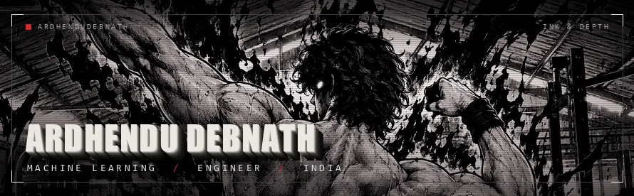
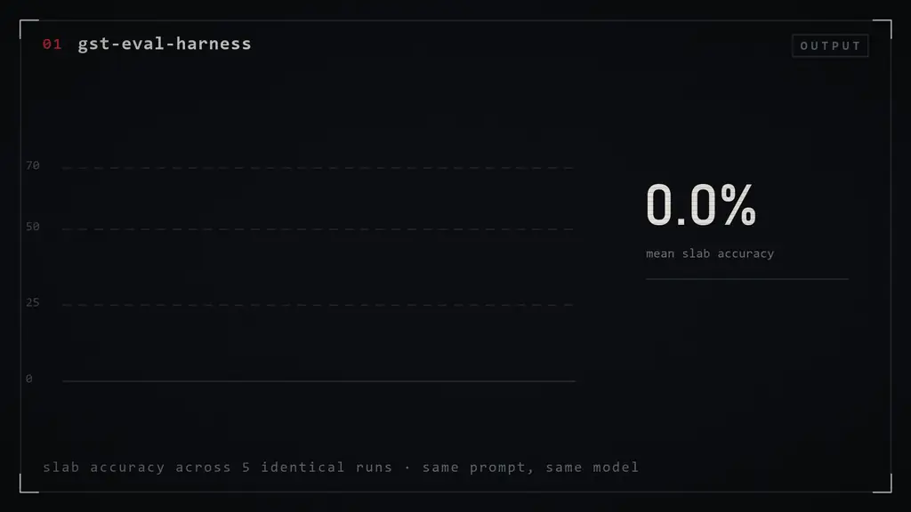
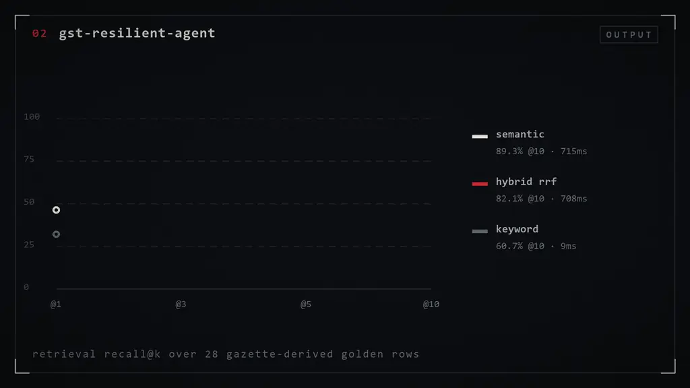
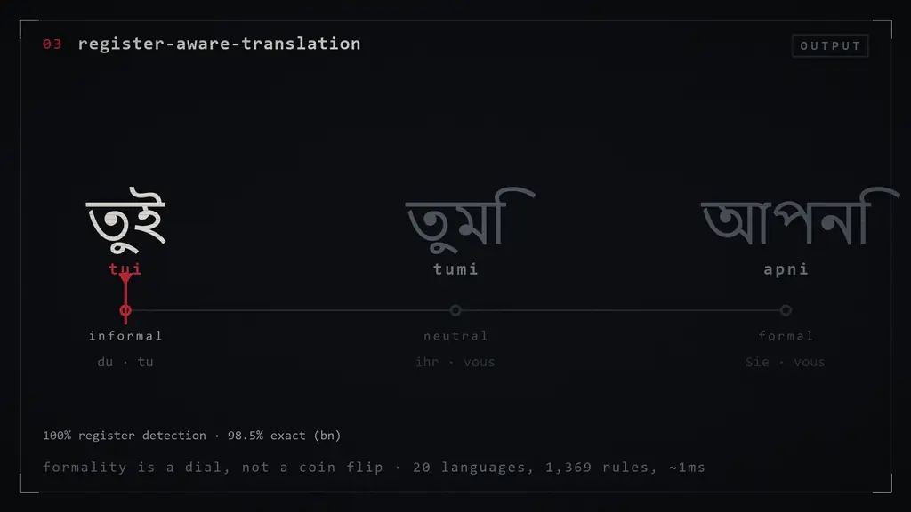
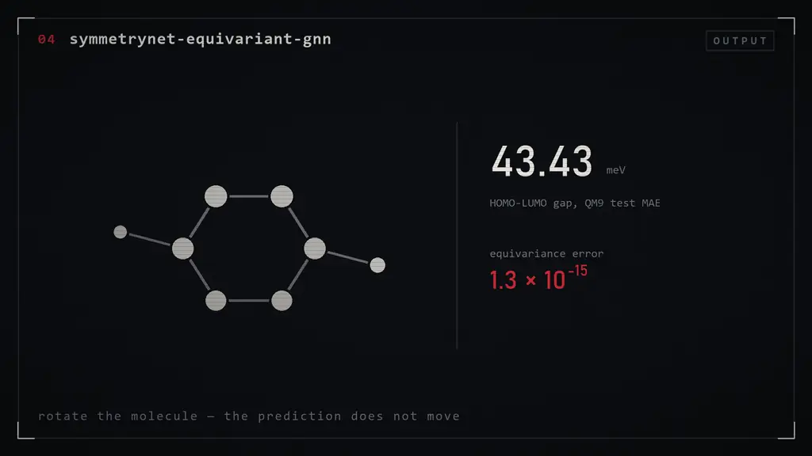
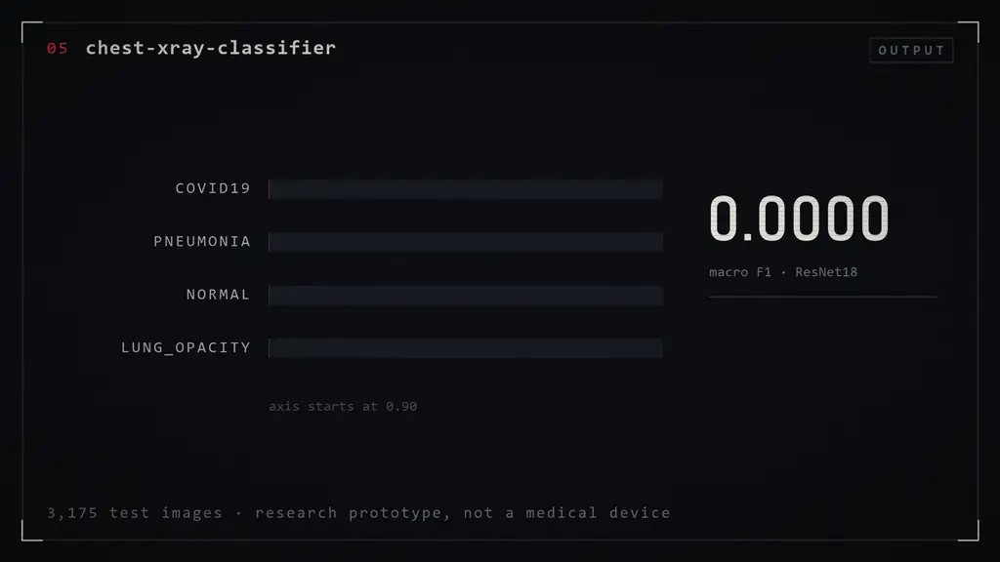
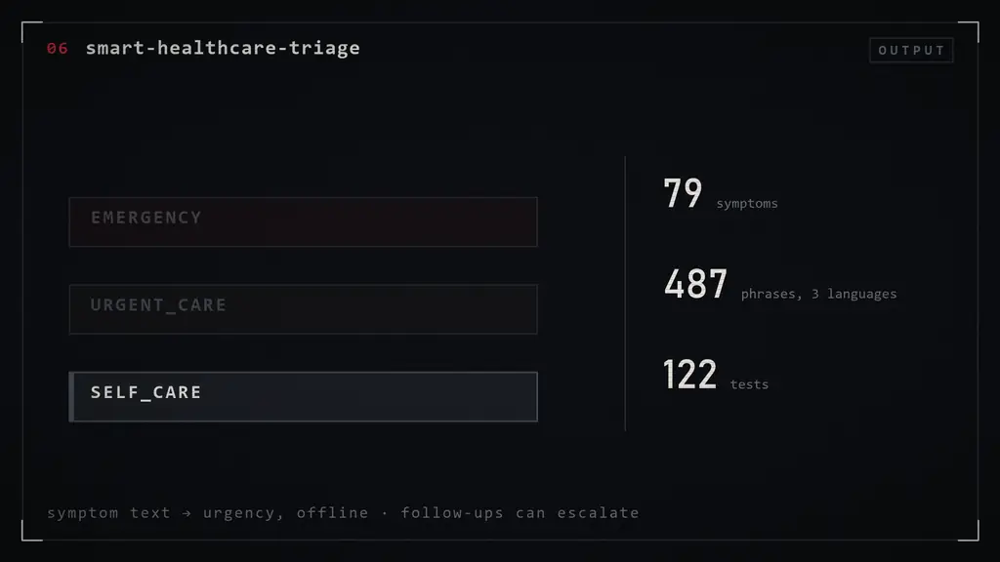
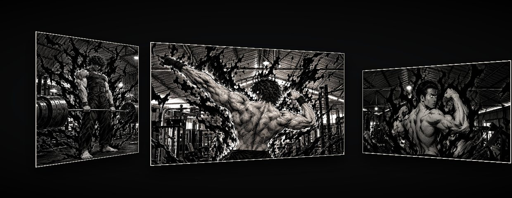



B.Tech, India. I build machine learning systems and the unglamorous plumbing underneath them — benchmarks, evaluation harnesses, and agents that have to keep working when the inputs get messy.

Most of the current work sits in **one vertical: Indian GST**. Three repos that feed each other beat three unrelated demos, so the harness that scores the benchmark is the same harness that scores the agent.

> Every number below is measured and reported in that project's own README. Nothing here is illustrative.

 

---

## `01` · gst-eval-harness

An open, hand-labelled benchmark for Indian GST rate-slab classification. India's slabs changed on 22 Sep 2025 and the 12% slab was abolished — this measures how often LLMs still answer from the old table.

**The finding:** run the *same* prompt against the *same* model five times and slab accuracy swings from 50.0% to 64.3%. Self-agreement is 53.6% — the model reproduces its own answer on only 15 of 28 rows. An abolished slab is recited somewhere in the response 11.4% of the time.

**[→ gst-eval-harness](https://github.com/ardhendudebnath/gst-eval-harness)**

---

## `02` · gst-resilient-agent

A multi-step agent that audits GST invoice lines against hash-pinned Gazette notifications — and the chaos harness built to break it. Seven tools, a hand-rolled loop, a failure taxonomy, and eleven injected failure modes.

**The finding:** semantic retrieval reaches 89.3% recall@10 against keyword's 60.7% — and pays 715ms for it versus 9ms. Hybrid RRF lands in between on both axes. Chaos injection configured at 10/25/50% actually fires at 8.2/24.9/49.3%.

**[→ gst-resilient-agent](https://github.com/ardhendudebnath/gst-resilient-agent)**

---

## `03` · register-aware-translation

Speech translation that gets the *register* right — তুই or আপনি, du or Sie. Standard translators collapse that distinction into an arbitrary choice; here it is a dial. 20 languages, works offline.

**The finding:** 100% register detection across all 20 languages, 98.5% exactness on Bengali, and 95.3% agreement against the external FAME-MT set over 30,281 sentences. The register layer itself costs about 1 millisecond.

**[→ register-aware-translation](https://github.com/ardhendudebnath/register-aware-translation)**

---

## `04` · symmetrynet-equivariant-gnn

Predicting molecular properties with neural networks that are *provably* invariant to rotation — representation theory implemented from scratch rather than bolted on with data augmentation.

**The finding:** equivariance verified to 1.3 × 10⁻¹⁵ relative error, against 1.2 × 10⁻² for a naive GNN. On QM9 HOMO-LUMO gap, equivariant PaiNN hits 43.43 meV test MAE versus 56.03 meV for a distance-only baseline — and its advantage *widens* with data, from 1.16× at 11k molecules to 1.29× at 110k.

**[→ symmetrynet-equivariant-gnn](https://github.com/ardhendudebnath/symmetrynet-equivariant-gnn)**

---

## `05` · chest-xray-classifier

Four-class CNN over chest radiographs — NORMAL, PNEUMONIA, COVID19, LUNG_OPACITY — with Grad-CAM, SHAP, and a Mahalanobis out-of-distribution check. *Research prototype. Not a medical device, not clinically validated.*

**The finding:** ResNet18 reaches 0.9587 macro F1 over 3,175 test images, edging out ResNet50 — the smaller backbone wins. Masking to lungs only drops it to 0.9341, which is the honest number: some of the signal was never in the lungs.

**[→ chest-xray-classifier](https://github.com/ardhendudebnath/chest-xray-classifier)**

---

## `06` · smart-healthcare-triage

Symptom-based triage assistant. Describe symptoms in English, Hindi or Bengali; get an urgency class, a helpline, and a specialist suggestion. Works offline, audits every decision with a timestamp, and produces a structured clinical handoff.

**The finding:** follow-up questions can *escalate* a case — triage is not a single-shot classification. 79 symptoms, 487 phrases across three languages, 122 tests covering the safety overrides.

**[→ smart-healthcare-triage](https://github.com/ardhendudebnath/smart-healthcare-triage)**

---

## Earlier work

| Repo | What | Year |
|---|---|---|
| [Chatbot_customer_satisfaction-project](https://github.com/ardhendudebnath/Chatbot_customer_satisfaction-project) | Customer sentiment chatbot — NLP preprocessing, word-frequency and heatmap analysis | 2024 |
| [predicting_customer_churn...](https://github.com/ardhendudebnath/predicting_customer_churn_for_a_telecommunications_company) | Telecom churn prediction and retention signals | 2024 |
| [House_price_prediction](https://github.com/ardhendudebnath/House_price_prediction) | Regression on housing data | 2024 |
| [sonar_rock-vs-mine-prediction-](https://github.com/ardhendudebnath/sonar_rock-vs-mine-prediction-) | Binary classification on sonar returns | 2024 |
| [Cognifyz-Internship-Project](https://github.com/ardhendudebnath/Cognifyz-Internship-Project) | Machine learning and data analysis internship work | 2025 |
| [Image_Classification_Project-](https://github.com/ardhendudebnath/Image_Classification_Project-) | Image classification practice | 2025 |

---

## Toolbox

**Modelling**

**LLM &amp; NLP**

**Serving &amp; infra**

---

## Numbers

---

**[Open the live 3D version →](https://ardhendudebnath.github.io/ardhendudebnath/3d/)**

Each plate is a real 3D surface there — a depth map drives per-pixel parallax in a hand-written WebGL shader, no libraries.

 

<b>Load the bar. Then add weight.</b>

