

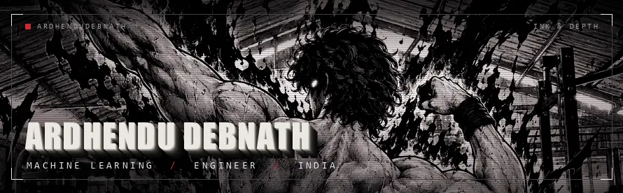

B.Tech, India. I build machine learning systems and the unglamorous plumbing underneath them — benchmarks, evaluation harnesses, and agents that have to keep working when the inputs get messy.

Most of the current work sits in **one vertical: Indian GST**. Three repos that feed each other beat three unrelated demos, so the harness that scores the benchmark is the same harness that scores the agent.

> Every number below is measured and reported in that project's own README. Nothing here is illustrative.

 

---

## `01` · llm-gateway-rag

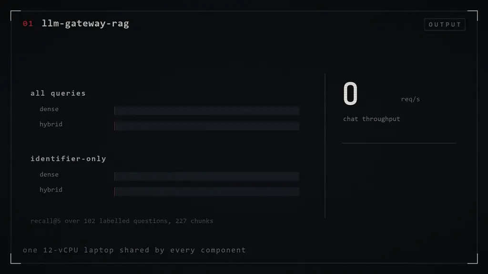

A self-hosted LLM gateway and RAG backend. One OpenAI-compatible API in front of several providers, with automatic fallback, circuit breakers and a tenant-isolated semantic cache. Documents are ingested by background workers into Qdrant; questions come back reranked with numbered citations. No LangChain, no LlamaIndex.

**The finding:** hybrid retrieval takes recall@5 from 0.873 to **1.000**, and identifier-only queries — the ones dense embeddings are worst at — from 0.722 to **1.000**, in 14.7 ms. Adding backpressure took chat throughput from 20.6 to **156.8 req/s**; before it, unbounded inference OOM-killed the API at 50 users with 74% errors. Killing the primary provider mid-traffic produced **0 user-visible failures across 2,100 requests**, breakers opening 0.9 s after the fault. The RAG p95 target of 1 s was *not* met — it sits at 1.4 s.

**[→ llm-gateway-rag](https://github.com/ardhendudebnath/llm-gateway-rag)**

---

## `02` · vision-rl-navigation

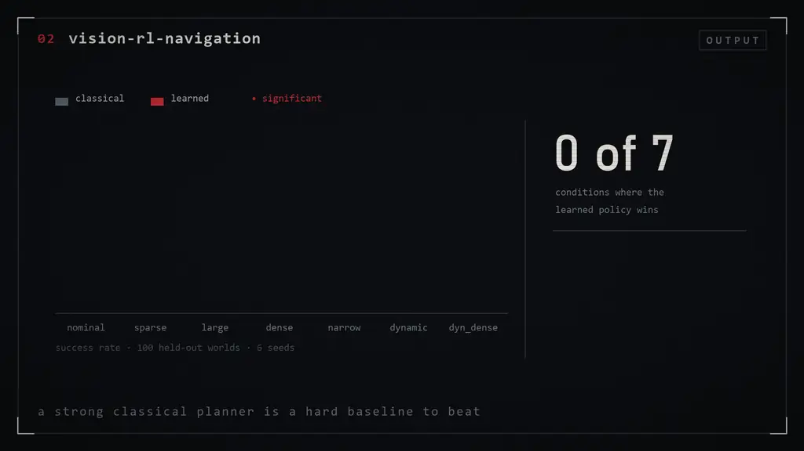

Vision-conditioned reinforcement learning for mobile robot navigation, measured against a classical planner rather than against nothing. A differential-drive robot reaching a goal pose in procedurally generated arenas, 32-beam lidar, continuous `(v, ω)`. Pre-registered endpoints, exact permutation tests, six seeds per arm.

**The finding:** across seven conditions the learned policy beats the classical planner in **none of them** — closest on `dynamic` (−0.020, not significant), worst on `narrow` (−0.168). The reward asymmetry turned out to matter more than the architecture: collisions cost 20 and a full timeout cost 5, so collisions fell from 27 to 2 per 100 episodes and 21 of 25 recovered episodes simply became timeouts. RGB policies trailed depth by 0.16–0.24 on every condition. Real Nav2 over ROS 2, meanwhile, *beats* the classical baseline on the cluttered conditions.

**[→ vision-rl-navigation](https://github.com/ardhendudebnath/vision-rl-navigation)**

---

## `03` · emotionedge-cpp

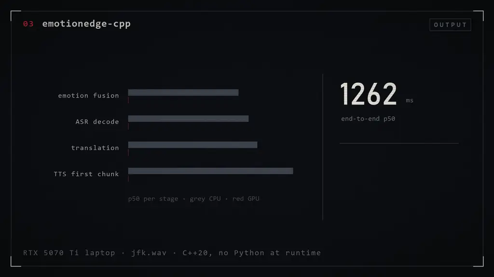

Real-time speech translation that keeps the speaker's emotion. ASR, emotion detection across valence/arousal/dominance, emotion-aware translation and expressive TTS in one C++20 process with **no Python at runtime**, on ONNX Runtime.

**The finding:** moving the pipeline to GPU collapsed end-to-end p50 from 1262 ms to **365 ms**, p95 to 631 ms against an 800 ms budget, using 5 s of CPU time instead of 51 s — with quality held (RAVDESS WER 0.042, chrF 56.70 on CUDA against 56.72 on CPU). The emotion-token NLLB LoRA beats plain NLLB-600M on FLORES chrF, 56.7 to 55.8. Echo cancellation was built, measured and **not adopted**: WebRTC AEC3 removed 8.6–14.7 dB of loudspeaker echo but fragmented the transcript, so it stays off until it can be tuned on real hardware.

**[→ emotionedge-cpp](https://github.com/ardhendudebnath/emotionedge-cpp)**

---

## `04` · symmetrynet-equivariant-gnn

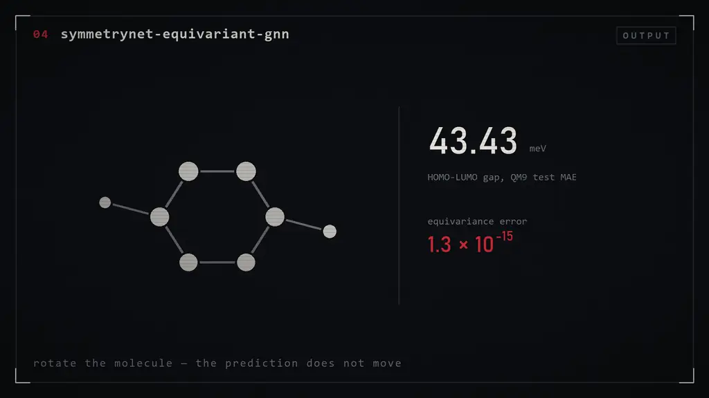

Predicting molecular properties with neural networks that are *provably* invariant to rotation — representation theory implemented from scratch rather than bolted on with data augmentation.

**The finding:** equivariance verified to 1.3 × 10⁻¹⁵ relative error, against 1.2 × 10⁻² for a naive GNN. On QM9 HOMO-LUMO gap, equivariant PaiNN hits 43.43 meV test MAE versus 56.03 meV for a distance-only baseline — and its advantage *widens* with data, from 1.16× at 11k molecules to 1.29× at 110k.

**[→ symmetrynet-equivariant-gnn](https://github.com/ardhendudebnath/symmetrynet-equivariant-gnn)**

---

## `05` · gst-resilient-agent

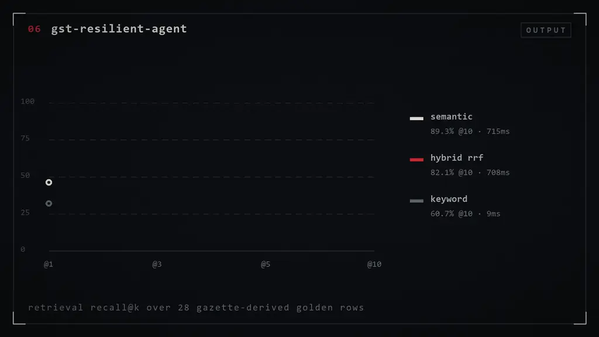

A multi-step agent that audits Indian GST invoice lines against hash-pinned Gazette notifications — and the chaos harness built to break it. Seven tools, a hand-rolled loop, a failure taxonomy, and eleven injected failure modes.

**The finding:** semantic retrieval reaches 89.3% recall@10 against keyword's 60.7% — and pays 715 ms for it versus 9 ms. Hybrid RRF lands in between on both axes. Chaos injection configured at 10/25/50% actually fires at 8.2/24.9/49.3%.

**[→ gst-resilient-agent](https://github.com/ardhendudebnath/gst-resilient-agent)**

---

## `06` · register-aware-translation

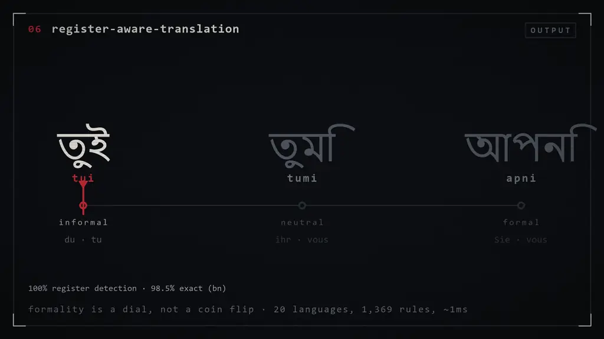

Speech translation that gets the *register* right — তুই or আপনি, du or Sie. Standard translators collapse that distinction into an arbitrary choice; here it is a dial. 20 languages, works offline.

**The finding:** 100% register detection across all 20 languages, 98.5% exactness on Bengali, and 95.3% agreement against the external FAME-MT set over 30,281 sentences. The register layer itself costs about 1 millisecond.

**[→ register-aware-translation](https://github.com/ardhendudebnath/register-aware-translation)**

---

## `07` · chest-xray-classifier

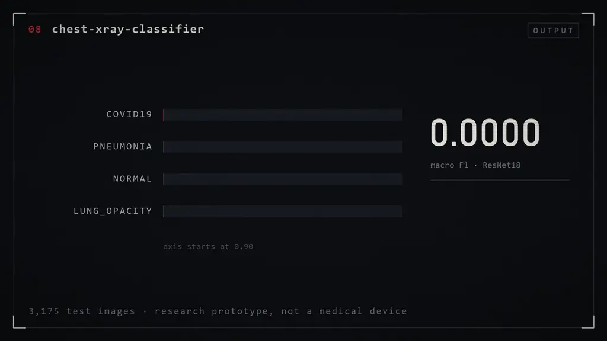

Four-class CNN over chest radiographs — NORMAL, PNEUMONIA, COVID19, LUNG_OPACITY — with Grad-CAM, SHAP, and a Mahalanobis out-of-distribution check. *Research prototype. Not a medical device, not clinically validated.*

**The finding:** ResNet18 reaches 0.9587 macro F1 over 3,175 test images, edging out ResNet50 — the smaller backbone wins. Masking to lungs only drops it to 0.9341, which is the honest number: some of the signal was never in the lungs.

**[→ chest-xray-classifier](https://github.com/ardhendudebnath/chest-xray-classifier)**

---

## `08` · smart-healthcare-triage

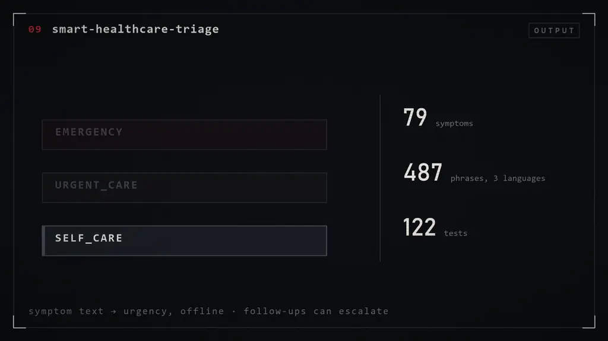

Symptom-based triage assistant. Describe symptoms in English, Hindi or Bengali; get an urgency class, a helpline and a specialist suggestion. Works offline, audits every decision with a timestamp, and produces a structured clinical handoff.

**The finding:** follow-up questions can *escalate* a case — triage is not a single-shot classification. 79 symptoms, 487 phrases across three languages, 122 tests covering the safety overrides.

**[→ smart-healthcare-triage](https://github.com/ardhendudebnath/smart-healthcare-triage)**

---

## `09` · neuro-sathi

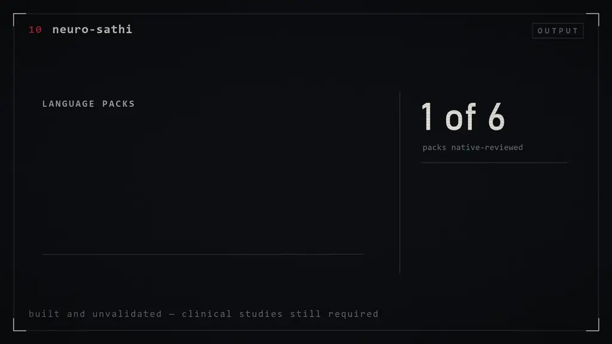

An offline-first multilingual companion for elderly cognitive care in North-East India — adaptive memory games, a voice companion, a memory book, medicine reminders, and a caregiver dashboard with baseline-deviation alerts. FastAPI, Flutter and Next.js over Postgres with row-level security.

**Status:** built, and deliberately not claimed as validated. **It does not diagnose.** Five of the six language packs — Assamese, Bengali, Nepali, Manipuri, Bodo — stay hidden from users until a native speaker reviews them. Deviation alerts compare the last 7 days against the previous 28 and flag changes beyond 2 SD, but the model behind them is still rules, not the trained tree-based or TFLite models planned. Clinical validation and usability studies remain outstanding.

**[→ neuro-sathi](https://github.com/ardhendudebnath/neuro-sathi)**

---

## `10` · llm-serving-unit-economics

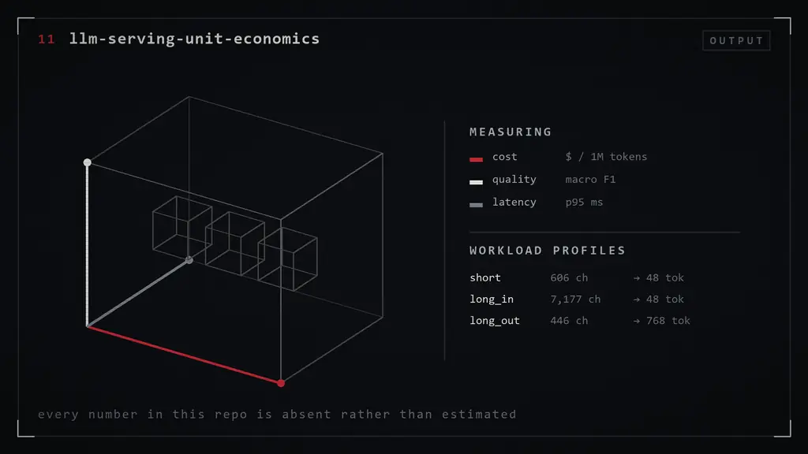

Serving an open-weight LLM on vLLM and Kubernetes, benchmarked against a paid API. Three dimensions — latency, quality, cost — pointed at one question: above what request volume does self-hosting actually win?

**Status: week 1 of 6. Build complete, nothing measured yet.** The diagram is the measurement *design*, not results — the repo's standing rule is that every number in it is **absent rather than estimated**, and those three slots stay empty until a run fills them. Defined so far: three workload profiles — `short` (606-char median prompt → 48 tokens), `long_in` (7,177 → 48), `long_out` (446 → 768) — on an RTX 5070 Ti Laptop with 12,227 MiB.

**[→ llm-serving-unit-economics](https://github.com/ardhendudebnath/llm-serving-unit-economics)**

---

## Toolbox

**Modelling**

**LLM &amp; NLP**

**Serving &amp; infra**

---

## Numbers

---

[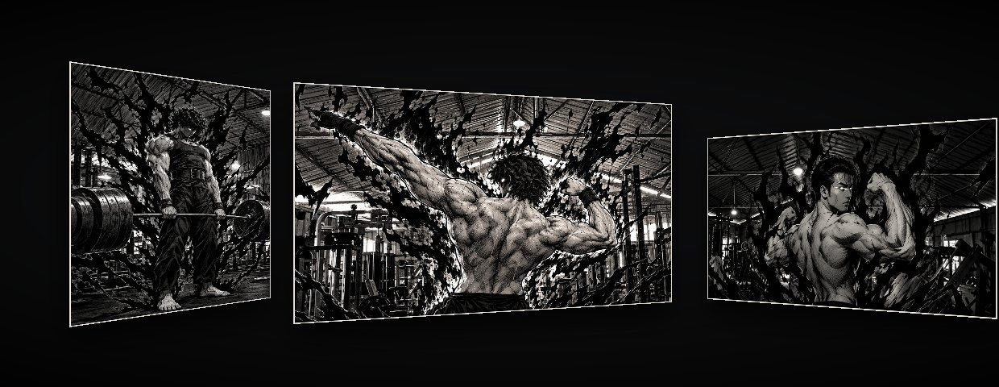](https://ardhendudebnath.github.io/ardhendudebnath/3d/)

**[Open the live 3D version →](https://ardhendudebnath.github.io/ardhendudebnath/3d/)**

Each plate is a real 3D surface there — a depth map drives per-pixel parallax in a hand-written WebGL shader, no libraries.

 

<b>Load the bar. Then add weight.</b>

